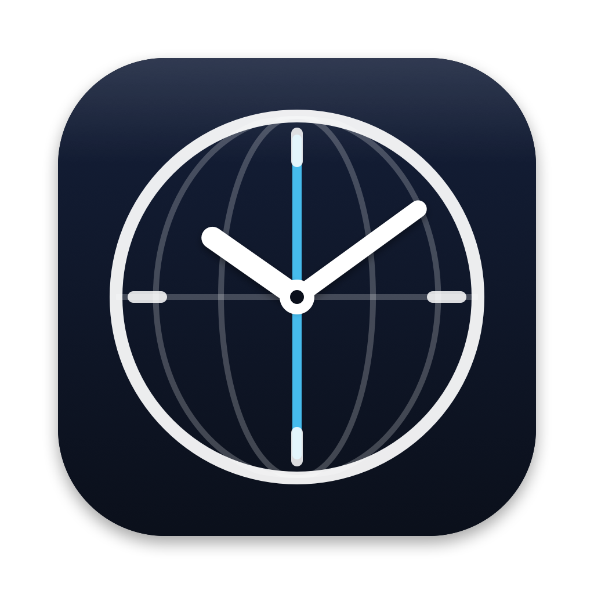
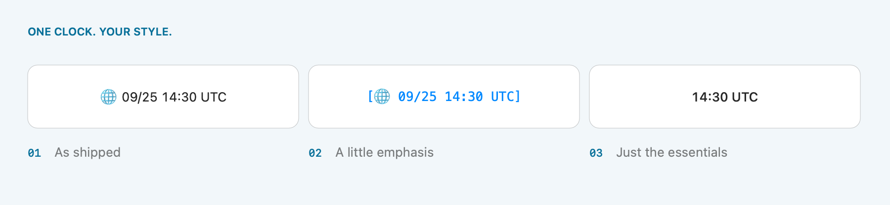
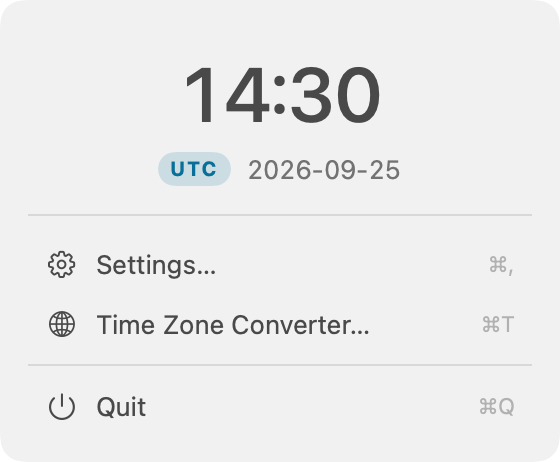
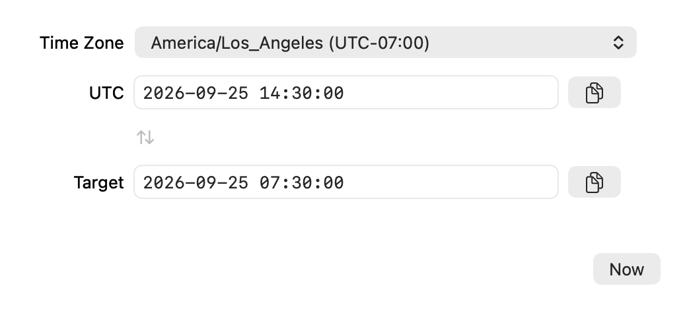
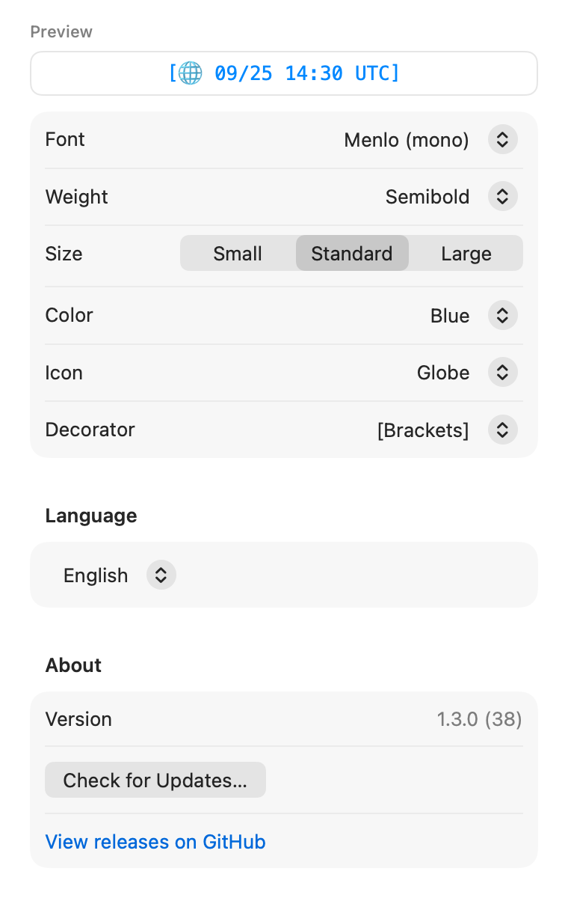

<p align="center">
  
</p>

<h1 align="center">UTCMenuBar</h1>

<p align="center">
  <i>UTC at a glance. Local time right where you left it.</i>
  <br>
  <b>A small Mac menu bar clock for everyone who works across time zones.</b>
</p>

<p align="center">
  <a href="https://github.com/NestDream/UTCMenuBar/releases/latest"></a>
  
  
  
  <a href="LICENSE"></a>
</p>

<p align="center">
  <a href="#-install">Download</a> ·
  <a href="#-screenshots">Screenshots</a> ·
  <a href="#-make-it-yours">Appearance</a> ·
  <a href="#-convert-in-both-directions">Time zones</a> ·
  <a href="#-privacy">Privacy</a> ·
  <a href="README.zh-CN.md">简体中文</a>
</p>

---

A log says `14:30 UTC`. Your Mac says `7:30`. Keep both in view.

UTCMenuBar adds a dedicated UTC clock beside your Mac's local clock. Give it a different font, color, or a pair of brackets, and you can tell the two apart before reading the digits. Useful for on-call shifts, deployment windows, and conversations that cross time zones.

<p align="center">
  <picture>
    <source media="(prefers-color-scheme: dark)" srcset="docs/assets/styles-dark.png">
    
  </picture>
</p>

<p align="center"><sub>One clock, your choice of emphasis. Examples rendered with the app's own text formatter and styling.</sub></p>

## 📦 Install

**[Download the latest release](https://github.com/NestDream/UTCMenuBar/releases/latest)** — macOS 13 Ventura or later, on Apple Silicon **or** Intel. The release ZIP contains a universal app.

1. Download `UTCMenuBar-vX.Y.Z.zip`, unzip it, and move **UTCMenuBar.app** into **Applications**.
2. Open the app. Its clock appears in the menu bar; there is no Dock icon.
3. To start it with your Mac, open **Settings → Launch at login**.

> [!NOTE]
> Release builds are ad-hoc signed and **not notarized by Apple**. If macOS blocks the first launch, and you trust the download, open **System Settings → Privacy & Security → Open Anyway** after attempting to open it. You can also [build from source](#-development).

Each release includes a SHA-256 checksum in its notes. To compare your download:

```sh
shasum -a 256 ~/Downloads/UTCMenuBar-vX.Y.Z.zip
```

For subsequent versions, right-click the clock and choose **Check for Updates…**. The app asks before downloading and installing an update. Automatic checks are enabled by default and can be turned off in Settings.

## 📸 Screenshots

The app's native SwiftUI and AppKit views, rendered with sample data. Images follow your light or dark appearance; the [full gallery](docs/SCREENSHOTS.md) shows both, in English and 简体中文.

<table>
  <tr><th>A click away</th><th>UTC ↔ your selected time zone</th></tr>
  <tr>
    <td align="center"><picture><source media="(prefers-color-scheme: dark)" srcset="docs/assets/screenshots/popover-en-dark.png"></picture></td>
    <td align="center"><picture><source media="(prefers-color-scheme: dark)" srcset="docs/assets/screenshots/converter-en-dark.png"></picture></td>
  </tr>
</table>

## ⚡ How to use

| Action | What happens |
| --- | --- |
| **Click** the clock | Open the live UTC panel, with the full date and quick actions. |
| **Right-click** or **Control-click** | Open display options, Appearance, language, and updates. |
| **⌘,** | Open Settings, with a preview of your menu bar clock. |
| **⌘T** | Open the Time Zone Converter. |
| **Esc** | Close the popover. |
| **⌘Q** | Quit UTCMenuBar. |

Keyboard shortcuts work while the popover is open; they are not system-wide hotkeys.

The default display is `🌐 09/25 14:30 UTC`: a compact date and 24-hour time. Turn off **Compact time** to show seconds, turn off **Compact date** for `2026-09-25`, or turn off **Show date** for a shorter clock. The date is always the date **in UTC**.

## 🎨 Make it yours

Open **Settings → Appearance** and watch the pinned preview as you change the clock.

<p align="center">
  <picture>
    <source media="(prefers-color-scheme: dark)" srcset="docs/assets/screenshots/settings-en-dark.png">
    
  </picture>
</p>

| Setting | Choices |
| --- | --- |
| **Font** | System, Menlo, SF Mono, or any installed font through the macOS font panel |
| **Weight & size** | Four weights; Small, Standard, or Large |
| **Color** | Default, Blue, Green, Orange, Purple, or Red; system colors adapt to appearance |
| **Icon** | 🌐 Globe, 🕐 Clock, 🧭 Compass, 🌍 Earth, or no icon |
| **Decorator** | Plain, `[brackets]`, `(parentheses)`, or `│bars│` |
| **Language** | English or 简体中文; switch immediately without restarting |

Styling applies to the menu bar and Settings preview. The popover keeps its own large, readable clock. Preferences are saved locally and restored on the next launch.

## 🌐 Convert in both directions

Open **Time Zone Converter…**, choose a time zone, and edit either field:

```text
UTC                    2026-09-25 14:30:00
America/Los_Angeles     2026-09-25 07:30:00
```

**UTC → local:** paste a UTC timestamp to find the corresponding local time. **Local → UTC:** edit the target field to get a UTC timestamp for a deployment or handoff.

Use `YYYY-MM-DD HH:MM:SS`. **Now** fills both fields with the current instant; the copy button beside either field copies its value. The app remembers your selected time zone and uses macOS time-zone rules for the entered date, including daylight saving time.

The converter handles one selected target zone at a time. The menu bar clock always stays on UTC.

## 🔒 Privacy

No accounts, subscriptions, ads, or telemetry. Clock display and time-zone conversion run locally using your Mac's clock and time-zone data.

**Update checks use the network.** The app contacts GitHub for release information and downloads a release when you choose **Install Now**. Automatic checks run on eligible launches, at most once per 24 hours after a successful check. Disable **Automatically check for updates** in Settings if you prefer manual checks.

Appearance, language, display options, the selected time zone, and update preferences stay in local `UserDefaults`. The app does not need Accessibility or Screen Recording permission.

## ❓ FAQ

#### Does this change my Mac's time zone?

No. Your system clock stays as it is. UTCMenuBar displays the same instant in UTC.

#### Does it need an internet time server?

The clock and converter work offline. UTCMenuBar reads your Mac's system time; it does not independently synchronize it with a time server.

#### Can I show several clocks, use 12-hour time, or copy an ISO timestamp?

The menu bar currently shows one UTC clock in 24-hour format. Copying is available in the converter as `YYYY-MM-DD HH:MM:SS`; clicking the menu bar clock opens the popover. Multiple pinned zones, a 12-hour option, and direct ISO / Unix timestamp copying are not implemented. See the [roadmap](docs/ROADMAP.md).

#### Why is there no Dock icon?

UTCMenuBar is a menu bar accessory. Open Settings or quit from its clock. Launch-at-login is optional.

## 🛠 Development

Requires **macOS 13+** and a **Swift 6 toolchain with the macOS SDK**. Check `swift --version` before building. This is a Swift Package Manager project with **zero external package dependencies**.

```sh
git clone https://github.com/NestDream/UTCMenuBar.git
cd UTCMenuBar
./scripts/build-app.sh
open UTCMenuBar.app
```

The script builds a release app for your Mac's architecture. Move the resulting `UTCMenuBar.app` to Applications for daily use. To build for both architectures:

```sh
./scripts/build-app.sh release --universal
```

For development and verification:

```sh
swift build                     # debug build
./scripts/test.sh               # custom test runner
./scripts/build-app.sh debug    # debug app bundle
```

Tests cover formatting, preferences, styling, conversion, menu actions, view models, popover placement, timer scheduling, and update decisions. The project uses a custom executable test runner, so use `scripts/test.sh` rather than `swift test`.

| Path | Purpose |
| --- | --- |
| [`Sources/`](Sources/) | AppKit status item and windows, SwiftUI views, login items, and update flow |
| [`Sources/UTCMenuBarLib/`](Sources/UTCMenuBarLib/) | Models, formatters, stores, view models, and testable helpers |
| [`Tests/UTCMenuBarTests/`](Tests/UTCMenuBarTests/) | Unit and randomized property tests |
| [`specs/`](specs/) | Feature requirements, designs, and implementation tasks |
| [`scripts/`](scripts/) | App packaging, tests, icon rendering, and documentation images |

Contributions are welcome. See [CONTRIBUTING.md](CONTRIBUTING.md) for the workflow, [CHANGELOG.md](CHANGELOG.md) for release history, and the [screenshot gallery](docs/SCREENSHOTS.md#regenerating-the-images) to regenerate the documentation images. The legacy Xcode project under `_archive/` is kept for reference.

## License

[MIT](LICENSE). Free to use, study, and modify.
