# Screenshot gallery

[← README](../README.md) · [简体中文](../README.zh-CN.md)

These images render UTCMenuBar's actual SwiftUI and AppKit views with a fixed sample time: **September 25, 2026, 14:30 UTC**. The converter shows the same instant in `America/Los_Angeles`, **07:30**. Settings uses Menlo Semibold, Blue, and brackets to demonstrate the live preview.

They are native view captures, not whole-desktop screenshots. Window chrome, wallpaper, and unrelated menu bar items are omitted. English and Chinese views use identical sample data. The style strip is an illustration rendered through the app's actual `TimeFormatter` and `StyledTextBuilder`.

## English

### UTC popover

| Light | Dark |
| --- | --- |
|  | 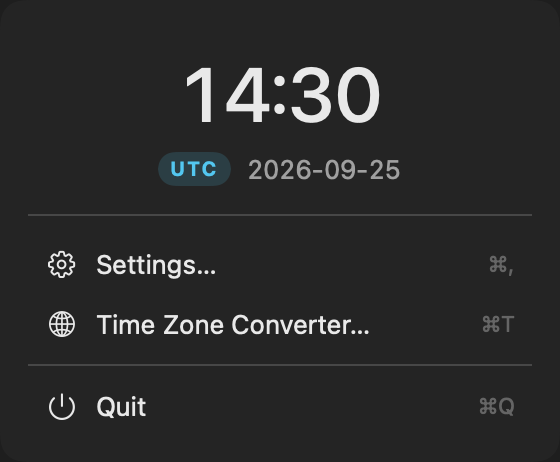 |

### Settings

Appearance, language, and About, with the clock preview pinned above the scrollable form:

| Light | Dark |
| --- | --- |
|  | 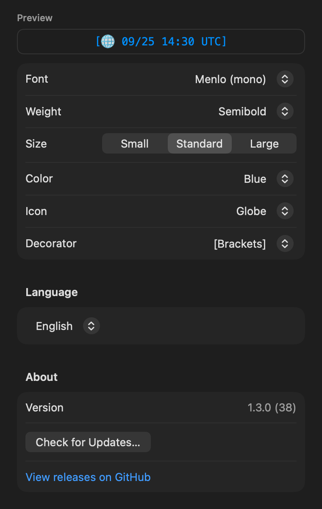 |

<details>
<summary>General and display settings at the top of the form</summary>

| Light | Dark |
| --- | --- |
| 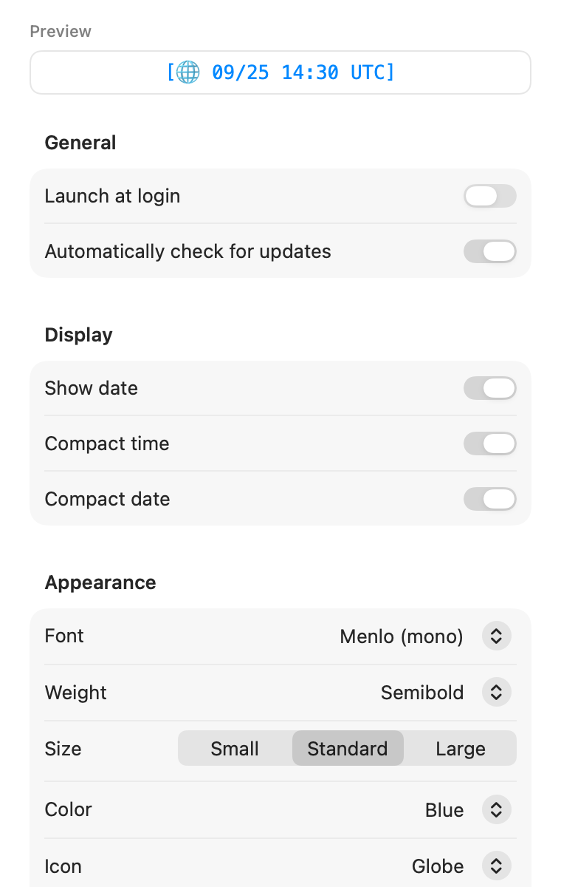 | 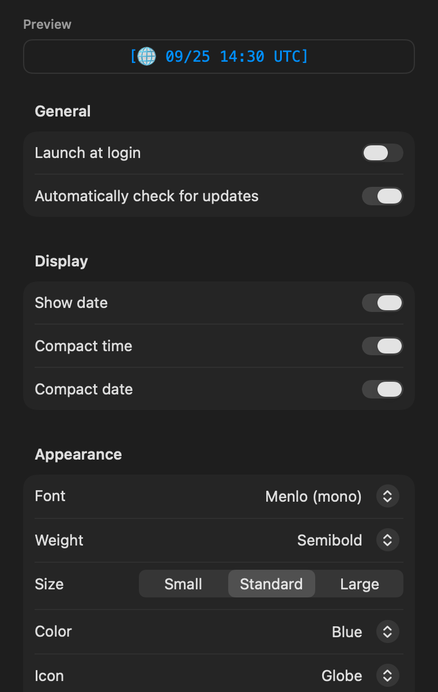 |

</details>

### Time Zone Converter


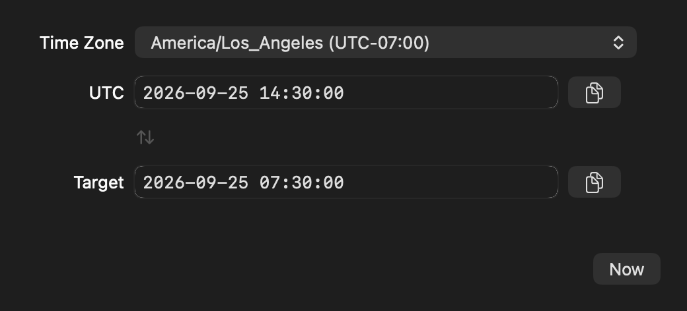

## 简体中文

### UTC 浮窗

| 浅色 | 深色 |
| --- | --- |
| 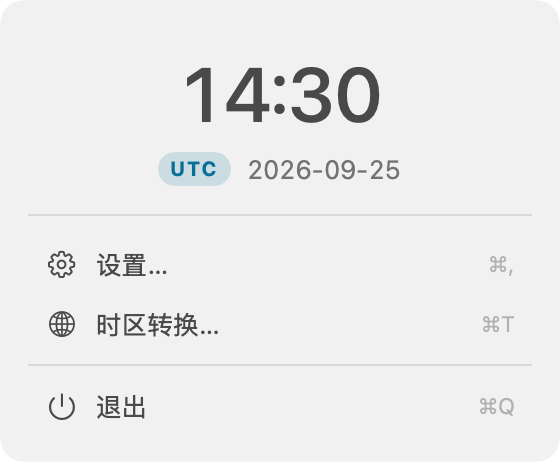 | 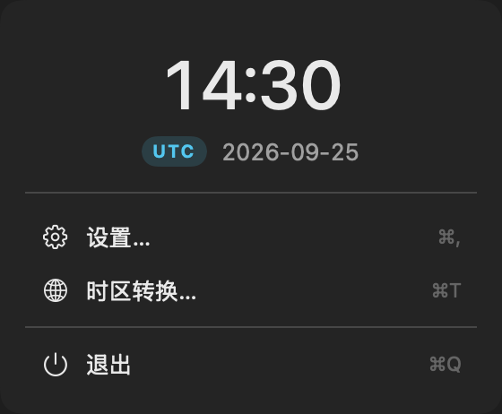 |

### 设置

滚动至外观、语言与关于部分，时钟预览始终固定在顶部：

| 浅色 | 深色 |
| --- | --- |
| 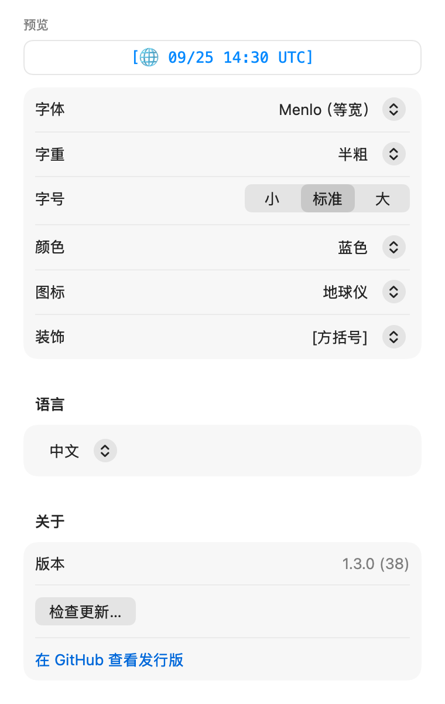 | 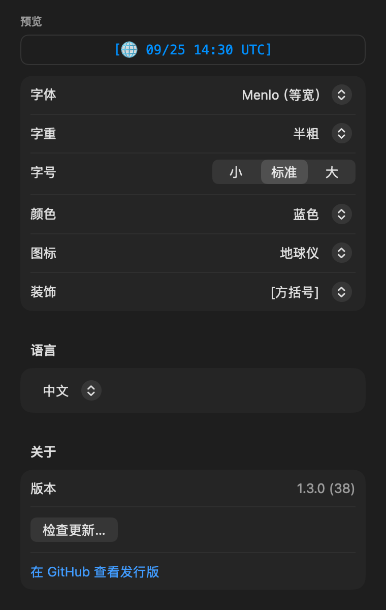 |

<details>
<summary>表单顶部的通用与显示设置</summary>

| 浅色 | 深色 |
| --- | --- |
| 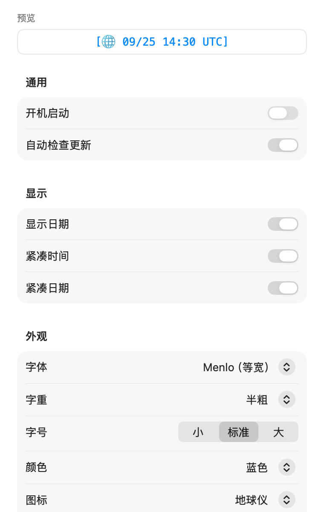 | 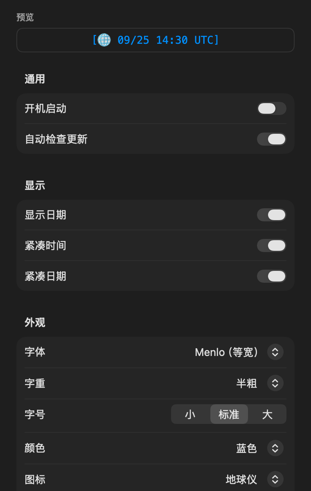 |

</details>

### 时区转换

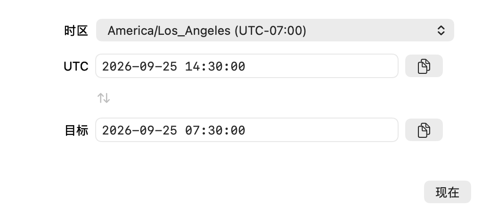

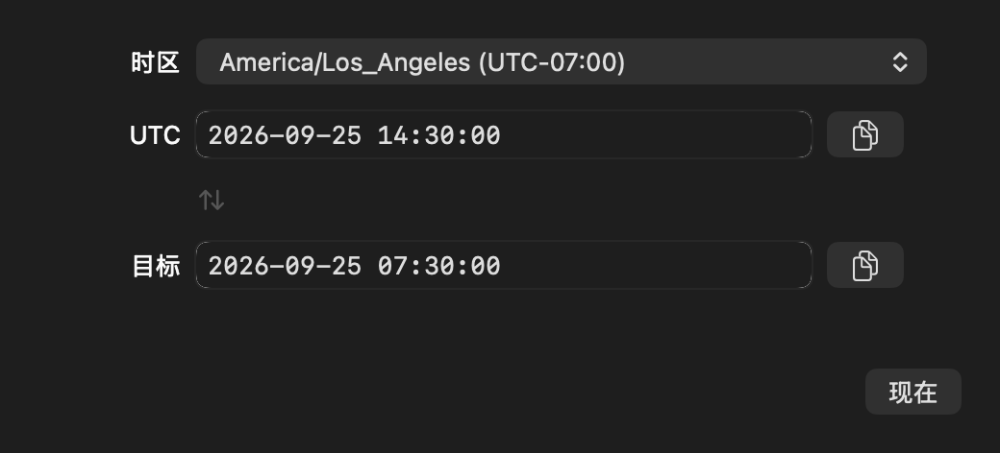

## Clock styling


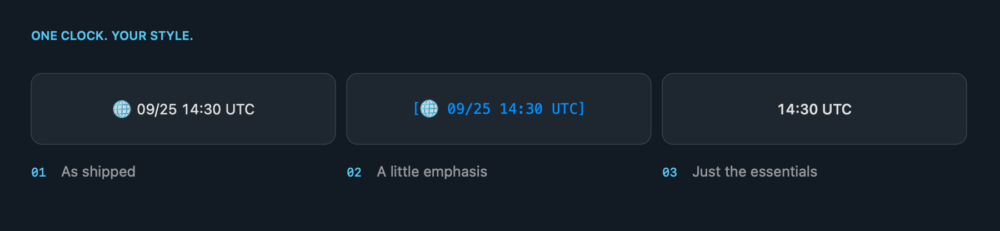

## Regenerating the images

On a Mac with a logged-in graphical session and a Swift 6 toolchain:

```sh
./scripts/render-readme.sh
```

The script builds the library, compiles the existing views into a temporary documentation app, and exports **18 PNGs at 2× resolution** into `docs/assets/`. It uses isolated preferences, a fixed clock reading, and an inactive login-item adapter. It does not launch the regular app, change its settings, register a login item, or check for updates.

The converter sample is entered through its existing text-change handler and checked before capture. The Settings version comes from the most recent `v*` Git tag. The macOS version can affect native control rendering, and the converter's time-zone picker labels show offsets at capture time, just as they do in the app.

To inspect a fresh set before replacing the committed images:

```sh
./scripts/render-readme.sh /tmp/utcmenubar-readme
```

The original development preview command remains available in Debug builds through `--render-previews <directory>`.
