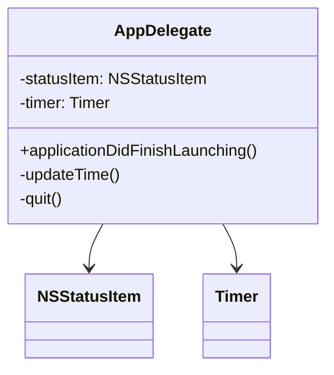
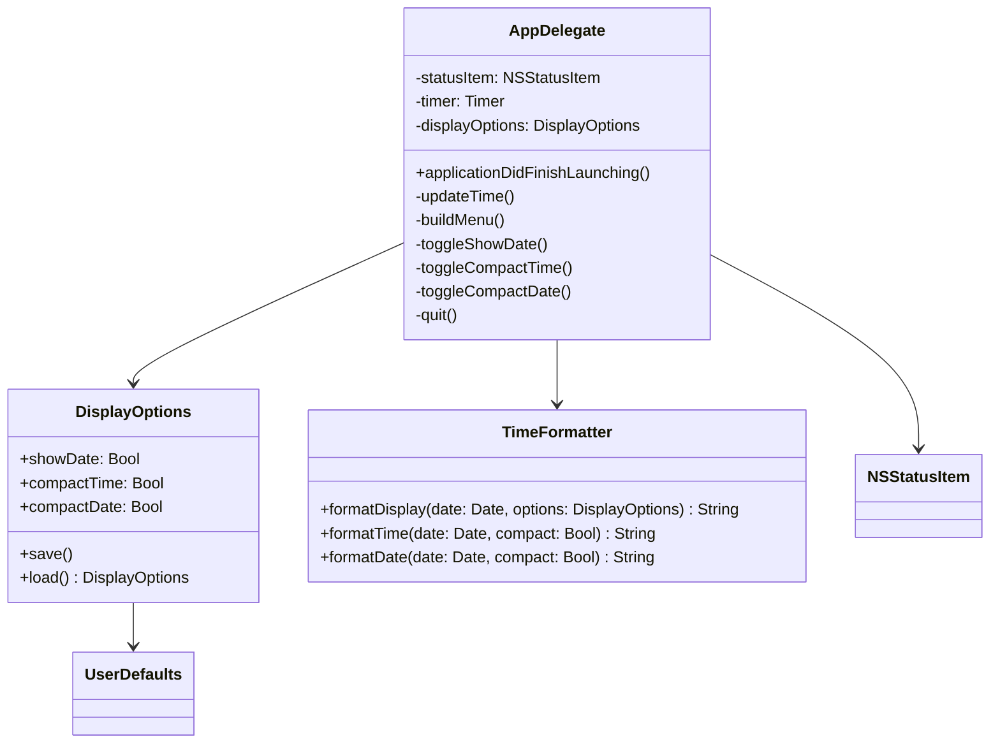

# 设计文档：显示选项（Display Options）

## 概述

本设计为 UTCMenuBar macOS 菜单栏应用添加可配置的显示选项功能。当前应用在 `AppDelegate.swift` 中以固定格式 `"🌐 HH:mm:ss UTC"` 显示 UTC 时间，所有逻辑集中在一个类中。

本功能将引入以下能力：
- 显示/隐藏日期的开关
- 时间紧凑模式（省略秒数）
- 日期紧凑模式（省略年份）
- 通过 UserDefaults 持久化用户偏好
- 切换选项后实时更新菜单栏显示
- 带分隔线和勾选标记的有组织菜单结构

设计原则：保持应用的轻量特性，不引入不必要的复杂度。所有新增逻辑仍在 `AppDelegate.swift` 中实现，通过提取独立的 `DisplayOptions` 模型和 `TimeFormatter` 来保持代码清晰。

## 架构

### 当前架构



### 目标架构



### 设计决策

1. **不引入新文件**：应用非常简单（单文件约 30 行），将 `DisplayOptions` 和 `TimeFormatter` 作为结构体/类添加到同一文件中，避免过度工程化。如果未来功能增长，可以再拆分。

2. **使用 struct 而非 class 作为 DisplayOptions**：`DisplayOptions` 是纯数据模型，使用值类型更安全，避免意外共享状态。

3. **菜单重建策略**：每次选项变更时重建整个菜单（而非逐项更新），因为菜单项数量极少（3 个选项 + 分隔线 + Quit），重建成本可忽略，且代码更简洁。

## 组件与接口

### DisplayOptions（显示选项模型）

```swift
struct DisplayOptions {
    var showDate: Bool       // 是否显示日期，默认 false
    var compactTime: Bool    // 是否使用紧凑时间格式，默认 false
    var compactDate: Bool    // 是否使用紧凑日期格式，默认 false

    // UserDefaults 键名
    static let showDateKey = "displayOptions.showDate"
    static let compactTimeKey = "displayOptions.compactTime"
    static let compactDateKey = "displayOptions.compactDate"

    // 默认值
    static let `default` = DisplayOptions(
        showDate: false,
        compactTime: false,
        compactDate: false
    )

    // 保存到 UserDefaults
    func save()

    // 从 UserDefaults 加载
    static func load() -> DisplayOptions
}
```

### TimeFormatter（时间格式化器）

```swift
enum TimeFormatter {
    // 根据选项生成完整的菜单栏显示字符串
    // 格式: "🌐 {日期} {时间} UTC" 或 "🌐 {时间} UTC"
    static func formatDisplay(date: Date, options: DisplayOptions) -> String

    // 格式化时间部分
    // compact=false: "HH:mm:ss", compact=true: "HH:mm"
    static func formatTime(date: Date, compact: Bool) -> String

    // 格式化日期部分
    // compact=false: "yyyy-MM-dd", compact=true: "MM/dd"
    static func formatDate(date: Date, compact: Bool) -> String
}
```

### AppDelegate 扩展接口

```swift
// 新增属性
private var displayOptions: DisplayOptions

// 新增方法
private func buildMenu()           // 构建/重建菜单
@objc private func toggleShowDate()    // 切换显示日期
@objc private func toggleCompactTime() // 切换紧凑时间
@objc private func toggleCompactDate() // 切换紧凑日期
```

### 菜单结构

```
┌─────────────────────────┐
│ ✓ 显示日期              │
│ ─ 紧凑时间              │
│ ─ 紧凑日期              │  ← 当"显示日期"禁用时灰显
│ ─────────────────────── │
│ Quit                  Q │
└─────────────────────────┘
```

## 数据模型

### DisplayOptions 状态

| 属性 | 类型 | 默认值 | UserDefaults 键 | 说明 |
|------|------|--------|-----------------|------|
| `showDate` | `Bool` | `false` | `displayOptions.showDate` | 是否在菜单栏显示日期 |
| `compactTime` | `Bool` | `false` | `displayOptions.compactTime` | 是否使用紧凑时间格式（HH:mm） |
| `compactDate` | `Bool` | `false` | `displayOptions.compactDate` | 是否使用紧凑日期格式（MM/dd） |

### 显示格式矩阵

| showDate | compactTime | compactDate | 显示结果示例 |
|----------|-------------|-------------|-------------|
| false | false | - | 🌐 14:30:25 UTC |
| false | true | - | 🌐 14:30 UTC |
| true | false | false | 🌐 2024-01-15 14:30:25 UTC |
| true | false | true | 🌐 01/15 14:30:25 UTC |
| true | true | false | 🌐 2024-01-15 14:30 UTC |
| true | true | true | 🌐 01/15 14:30 UTC |

### UserDefaults 持久化

- 写入时机：每次用户切换任何选项时立即调用 `displayOptions.save()`
- 读取时机：`applicationDidFinishLaunching` 中调用 `DisplayOptions.load()`
- 缺失处理：`UserDefaults.bool(forKey:)` 对不存在的键返回 `false`，恰好与所有默认值一致，无需额外处理


## 正确性属性（Correctness Properties）

*正确性属性是指在系统所有有效执行中都应保持为真的特征或行为——本质上是关于系统应该做什么的形式化声明。属性是人类可读规范与机器可验证正确性保证之间的桥梁。*

基于需求文档中的验收标准，经过分析和去重合并，得出以下可测试属性：

### 属性 1：showDate 控制日期可见性

*对于任意* Date 和任意 DisplayOptions，格式化输出中包含日期部分当且仅当 `showDate` 为 `true`。当 `showDate` 为 `false` 时，输出中不应包含任何日期信息。

**验证需求：1.2, 1.3**

### 属性 2：compactTime 控制秒数可见性

*对于任意* Date 和任意 DisplayOptions，当 `compactTime` 为 `true` 时，时间部分应匹配 `HH:mm` 格式（不含秒数）；当 `compactTime` 为 `false` 时，时间部分应匹配 `HH:mm:ss` 格式（包含秒数）。

**验证需求：2.2, 2.3**

### 属性 3：compactDate 控制日期格式

*对于任意* Date 和 `showDate` 为 `true` 的 DisplayOptions，当 `compactDate` 为 `true` 时，日期部分应匹配 `MM/dd` 格式；当 `compactDate` 为 `false` 时，日期部分应匹配 `yyyy-MM-dd` 格式。

**验证需求：3.2, 3.3**

### 属性 4：DisplayOptions 持久化往返一致性

*对于任意* DisplayOptions 值，将其保存到 UserDefaults 后再加载，应得到与原始值相等的 DisplayOptions。

**验证需求：4.1, 4.2**

### 属性 5：输出格式结构不变量

*对于任意* Date 和任意 DisplayOptions，格式化输出始终以 `"🌐 "` 开头、以 `" UTC"` 结尾。且当 `showDate` 为 `true` 时，日期部分出现在时间部分之前。

**验证需求：5.2, 5.3**

### 属性 6：菜单勾选状态与选项值一致

*对于任意* DisplayOptions 状态，每个菜单项的勾选标记（checkmark）状态应与其对应的选项布尔值一致：选项为 `true` 时显示勾选，为 `false` 时不显示勾选。

**验证需求：6.2, 6.3**

### 属性 7：紧凑日期可用性取决于 showDate

*对于任意* DisplayOptions 状态，"紧凑日期"菜单项的可用（enabled）状态应等于 `showDate` 的值。当 `showDate` 为 `false` 时，"紧凑日期"菜单项应为不可用（disabled）状态。

**验证需求：3.1, 6.4**

## 错误处理

### UserDefaults 读取失败

- `UserDefaults.standard.bool(forKey:)` 对不存在的键返回 `false`，与所有选项的默认值一致
- 无需额外的错误处理逻辑，系统自然回退到默认状态

### DateFormatter 异常

- `DateFormatter` 是 Foundation 框架的稳定 API，不会抛出异常
- 时区设置为 `"UTC"` 是有效的标识符，不存在解析失败的风险

### Timer 失效

- 保持现有的 `Timer` + `RunLoop.common` 模式
- `[weak self]` 防止循环引用，确保 AppDelegate 释放时 timer 自动失效

### 菜单状态不一致

- 每次选项变更时重建整个菜单，避免部分更新导致的状态不一致
- `updateTime()` 在每次 timer 触发和选项变更时都会调用，确保显示始终与选项同步

## 测试策略

### 双重测试方法

本功能采用单元测试与属性测试相结合的方式，确保全面覆盖。

### 属性测试（Property-Based Testing）

使用 Swift 的 [swift-testing](https://github.com/apple/swift-testing) 框架配合自定义随机输入生成器实现属性测试。由于 Swift 生态中成熟的 PBT 库有限，我们使用 `SwiftCheck`（如果可用）或手动生成随机输入的方式实现。

每个属性测试至少运行 100 次迭代。

| 属性 | 测试描述 | 标签 |
|------|---------|------|
| 属性 1 | 生成随机 Date 和 DisplayOptions，验证输出中日期部分的存在性与 showDate 一致 | Feature: display-options, Property 1: showDate controls date visibility |
| 属性 2 | 生成随机 Date 和 DisplayOptions，验证时间格式与 compactTime 设置一致 | Feature: display-options, Property 2: compactTime controls seconds visibility |
| 属性 3 | 生成随机 Date（showDate=true），验证日期格式与 compactDate 设置一致 | Feature: display-options, Property 3: compactDate controls date format |
| 属性 4 | 生成随机 DisplayOptions，保存后加载，验证往返一致性 | Feature: display-options, Property 4: DisplayOptions round-trip through UserDefaults |
| 属性 5 | 生成随机 Date 和 DisplayOptions，验证前缀、后缀和日期/时间顺序 | Feature: display-options, Property 5: output format structure invariant |
| 属性 6 | 生成随机 DisplayOptions，构建菜单，验证勾选状态与选项值一致 | Feature: display-options, Property 6: menu checkmark matches option state |
| 属性 7 | 生成随机 DisplayOptions，构建菜单，验证紧凑日期菜单项的 enabled 状态等于 showDate | Feature: display-options, Property 7: compact date availability depends on showDate |

### 单元测试

单元测试聚焦于具体示例、边界情况和默认值验证：

- **默认值测试**：验证 `DisplayOptions.default` 所有属性为 `false`（需求 1.4, 2.4, 3.4）
- **菜单结构测试**：验证菜单包含所有选项项、分隔线和 Quit 项（需求 1.1, 2.1, 6.1）
- **UserDefaults 空值测试**：验证从空 UserDefaults 加载返回默认值（需求 4.3）
- **具体格式示例**：验证已知日期在各选项组合下的精确输出字符串

### 测试文件组织

```
UTCMenuBar/UTCMenuBarTests/
├── DisplayOptionsTests.swift       // 单元测试
└── DisplayOptionsPropertyTests.swift  // 属性测试
```
