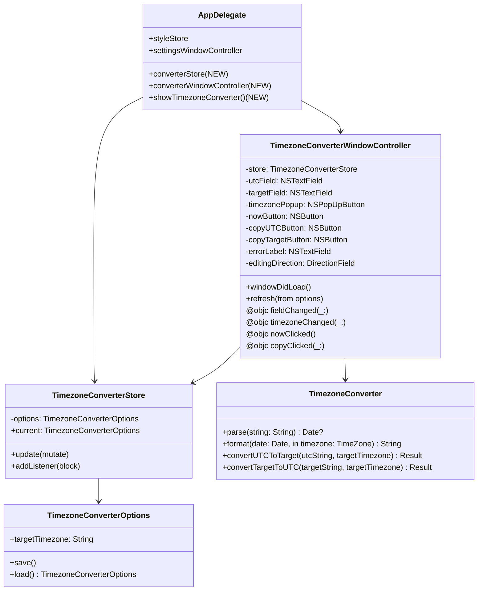

# 设计文档：时区转换器（Timezone Converter）

## 概述

本设计为 UTCMenuBar 增加 TimezoneConverter 功能。架构上严格沿用 visual-distinction 已经验证的模式：

- **数据层**：`TimezoneConverterOptions` 结构体（仅持久化目标时区）
- **核心逻辑**：`TimezoneConverter` 纯函数枚举（解析 / 格式化 / 双向转换）
- **状态层**：`TimezoneConverterStore`（@MainActor 类，listener 机制）
- **UI 层**：`TimezoneConverterWindowController`（程序化 AppKit）
- **入口**：`MenuBuilder` 增加菜单项 + ⌘T，AppDelegate 持有 store 与 window controller

设计原则：
1. 所有时间解析/格式化都使用 `Locale(identifier: "en_US_POSIX")`，避免本地化数字陷阱
2. 双向同步通过"活跃字段"标志（DirectionField）防止无限回响：编辑哪一边，就只更新另一边
3. 所有时区计算用 `DateFormatter.timeZone` 完成，不手动算偏移（DST 友好）
4. UI 层与逻辑层解耦：UI 仅负责把 `NSTextField` 文本喂给纯函数，结果再喂回 UI

## 架构



## 数据流

```
用户在 UTC 字段键入 "2025-06-15 12:00:00"
  ↓ NSTextField textDidChange
TimezoneConverterWindowController.fieldChanged(utcField)
  ↓ editingDirection = .utc
TimezoneConverter.convertUTCToTarget(utcString, targetTimezone)
  ↓ parse → Date → format(in: target)
返回 Result.success("2025-06-15 20:00:00") 或 .failure(.invalidFormat)
  ↓
UI: 把目标字段更新为 "2025-06-15 20:00:00"，清空 errorLabel
（不会反向触发 utc 字段更新，因为 editingDirection == .utc）
```

时区切换的数据流类似，但活跃字段保持 `.utc`，重新基于 utc 字段计算 target。

## 组件与接口

### TimezoneConverterOptions

```swift
public struct TimezoneConverterOptions: Equatable, Sendable {
    public var targetTimezone: String  // IANA identifier

    public static let targetTimezoneKey = "timezoneConverter.targetTimezone"

    public static var `default`: TimezoneConverterOptions {
        TimezoneConverterOptions(targetTimezone: TimeZone.current.identifier)
    }

    public func save(to defaults: UserDefaults = .standard) { ... }

    public static func load(from defaults: UserDefaults = .standard) -> TimezoneConverterOptions {
        let raw = defaults.string(forKey: targetTimezoneKey) ?? ""
        let valid = TimeZone.knownTimeZoneIdentifiers.contains(raw)
        return TimezoneConverterOptions(
            targetTimezone: valid ? raw : TimeZone.current.identifier
        )
    }
}
```

注意：`default` 是计算属性而非 `static let`，因为 `TimeZone.current` 取决于运行时环境。

### TimezoneConverter（纯函数核心）

```swift
public enum TimezoneConverter {

    public enum ConversionError: Error, Equatable {
        case invalidFormat        // 输入字符串无法解析
        case unknownTimezone      // 时区标识符不在 IANA 列表
        case yearOutOfRange       // 年份越界
    }

    public static let formatPattern = "yyyy-MM-dd HH:mm:ss"

    /// 解析字符串为 Date，假设字符串代表 UTC 时间
    public static func parseUTC(_ string: String) -> Result<Date, ConversionError>

    /// 解析字符串为 Date，假设字符串代表目标时区本地时间
    public static func parseInTimezone(
        _ string: String,
        timezone: TimeZone
    ) -> Result<Date, ConversionError>

    /// 把 Date 格式化为指定时区的本地时间字符串
    public static func format(date: Date, in timezone: TimeZone) -> String

    /// 双向转换：UTC → 目标时区
    public static func convertUTCToTarget(
        _ utcString: String,
        targetTimezoneId: String
    ) -> Result<String, ConversionError>

    /// 双向转换：目标时区 → UTC
    public static func convertTargetToUTC(
        _ targetString: String,
        targetTimezoneId: String
    ) -> Result<String, ConversionError>

    /// 取当前时间在 UTC 与指定时区下的字符串
    public static func now(targetTimezoneId: String) -> (utc: String, target: String)?
}
```

实现要点：
- `DateFormatter` 全部 `locale = Locale(identifier: "en_US_POSIX")`，`dateFormat = formatPattern`，`timeZone` 视场景设为 UTC 或目标时区
- DateFormatter 缓存：用 `static let` 私有的 `posixFormatter()` 工厂返回带预设 locale/format 的实例（每次调用克隆 timezone 即可）
- 年份越界判断：parse 成功后用 `Calendar(identifier: .gregorian)` 抽出 year，越 1900~2100 报 `.yearOutOfRange`

### TimezoneConverterStore

完全沿用 `StyleOptionsStore` 的形态：

```swift
@MainActor
final class TimezoneConverterStore {
    private(set) var current: TimezoneConverterOptions
    private var listeners: [(TimezoneConverterOptions) -> Void] = []
    private let defaults: UserDefaults

    init(defaults: UserDefaults = .standard) { ... }
    func update(_ mutate: (inout TimezoneConverterOptions) -> Void) { ... }
    func addListener(_ block: @escaping (TimezoneConverterOptions) -> Void) { ... }
}
```

### TimezoneConverterWindowController

视图层级（程序化 AppKit）：

```
NSWindow (titled+closable, 480×260, isReleasedWhenClosed=false, title "时区转换")
└── NSStackView (vertical, spacing 12, edgeInsets 20)
    ├── row 1：「时区」 label + timezonePopup (NSPopUpButton, 撑满)
    ├── row 2：「UTC」 label + utcField (NSTextField) + copyUTCButton (NSButton)
    ├── row 3：「目标」 label + targetField (NSTextField) + copyTargetButton (NSButton)
    ├── errorLabel (NSTextField, color=.systemRed, hidden when no error)
    └── footer: nowButton (NSButton, "现在", trailing aligned)
```

行 helper 与 SettingsWindowController 一致（label 60pt 右对齐 + 控件展开）。

`timezonePopup` 数据源：`TimeZone.knownTimeZoneIdentifiers.sorted()`，title 用 `"\(id) (\(offsetString))"`，其中 offset 来自 `TimeZone(identifier: id)?.secondsFromGMT()`。可选优化：分组（Asia / America / Europe / ...），但 v1 实现里直接 flat list 即可（500+ 项搜索通过 NSPopUpButton 自带 type-ahead 即可）。

`editingDirection`: `enum DirectionField { case utc, target }`。`fieldChanged` 在 textDidChange 调用，根据 sender 决定方向，调用对应 convert 函数，把结果回填**对方**字段。**关键**：回填时设置一个 `private var isProgrammaticUpdate = true` 标志，在 textDidChange 入口先检查这个标志，避免无限循环。

### MenuBuilder 扩展

新增菜单项 "时区转换…" + ⌘T，位置在"设置…"之后、第二条 separator 之前：

```
0  显示日期
1  紧凑时间
2  紧凑日期
3  ─────
4  外观   ▶
5  设置…  ⌘,
6  时区转换… ⌘T   (新增)
7  ─────
8  Quit   ⌘Q
```

`buildMenu` 签名增加参数 `showTimezoneConverter: Selector?`。

### AppDelegate 扩展

```swift
private let converterStore = TimezoneConverterStore()
private var converterWindowController: TimezoneConverterWindowController?

@objc private func showTimezoneConverter() {
    if converterWindowController == nil {
        converterWindowController = TimezoneConverterWindowController(store: converterStore)
        _ = converterWindowController!.window
    }
    NSApp.activate(ignoringOtherApps: true)
    converterWindowController!.showWindow(nil)
}
```

## 文件改动清单

| 操作 | 路径 | 层 |
|---|---|---|
| 新增 | `Sources/UTCMenuBarLib/TimezoneConverterOptions.swift` | lib |
| 新增 | `Sources/UTCMenuBarLib/TimezoneConverter.swift` | lib |
| 新增 | `Sources/TimezoneConverterStore.swift` | app |
| 新增 | `Sources/TimezoneConverterWindowController.swift` | app |
| 修改 | `Sources/UTCMenuBarLib/MenuBuilder.swift` | lib（加新参数 + 菜单项） |
| 修改 | `Sources/main.swift` | app |
| 新增 | `Tests/UTCMenuBarTests/TimezoneConverterOptionsTests.swift` | test |
| 新增 | `Tests/UTCMenuBarTests/TimezoneConverterTests.swift` | test |
| 新增 | `Tests/UTCMenuBarTests/TimezoneConverterPropertyTests.swift` | test |
| 修改 | `Tests/UTCMenuBarTests/MenuTests.swift` | test（菜单 9 项 + ⌘T） |
| 修改 | `Tests/UTCMenuBarTests/MenuPropertyTests.swift` | test |
| 修改 | `Tests/UTCMenuBarTests/TestRunner.swift` | test |

## 正确性属性（用于属性测试）

### Property TC1：UTC ↔ Target 往返一致性

对任意有效 UTC 字符串 `s` 与任意有效时区 `tz`：
```
convertTargetToUTC(convertUTCToTarget(s, tz).success!, tz).success! == s
```

### Property TC2：解析-格式化往返一致性

对任意 1900-2100 区间的随机 `Date`：
```
parseUTC(format(d, in: .utc))!.success!.timeIntervalSince(d) ≈ 0  (within 1s rounding)
```

### Property TC3：DST 切换正确性

对纽约时区（`America/New_York`）2025-03-09 02:30:00 本地时间：
- 此时刻在 DST 切换"跳过"区间，应有专门处理（DateFormatter 默认会 normalize 到 03:30:00）
- 测试该输入回到 UTC 后再回来，结果与 macOS Calendar 应用对齐

### Property TC4：时区识别符容错

对随机非法时区字符串，`convert*` 返回 `.failure(.unknownTimezone)`，不崩溃。

### Property TC5：持久化往返一致

随机有效时区 → save → load → 等价。

### Property TC6：非法时区持久化容错

向 UserDefaults 写入垃圾字符串后 `load` 应回退到 `TimeZone.current.identifier`。

## 测试方案

### 单元测试

**TimezoneConverterOptionsTests.swift**
- 默认值 = `TimeZone.current.identifier`
- 持久化往返
- 非法值容错回退到 `TimeZone.current`

**TimezoneConverterTests.swift**
- `parseUTC` 接受 `2025-06-15 12:00:00` 返回正确 Date
- `parseUTC` 拒绝 `12:00 PM`、`2025/06/15`、空串、`abc`
- `format(date, in: .utc)` 输出 `yyyy-MM-dd HH:mm:ss`
- `convertUTCToTarget("2025-06-15 12:00:00", "Asia/Shanghai")` == `"2025-06-15 20:00:00"`
- `convertTargetToUTC("2025-06-15 20:00:00", "Asia/Shanghai")` == `"2025-06-15 12:00:00"`
- `convertUTCToTarget("...", "Not/A/Zone")` == `.failure(.unknownTimezone)`
- DST 跨越点：`America/Los_Angeles` 2025-03-09 (Spring forward) 与 2025-11-02 (Fall back) 对照 macOS Calendar 验证

**TimezoneConverterPropertyTests.swift**
- TC1, TC2, TC4, TC5, TC6（每条 100 次迭代）

### 不做单测的部分（手测）

- TimezoneConverterWindowController 的 NSWindow 行为
- 双向同步无回响（NSTextField textDidChange 与 isProgrammaticUpdate 标志的交互）
- ⌘T 调度
- 复制按钮 NSPasteboard 写入
- 与 SettingsWindow 共存时的窗口管理

## 实现顺序

1. **数据层**: `TimezoneConverterOptions` + 单测
2. **核心逻辑**: `TimezoneConverter` + 全部单测/属性测试
3. **状态层**: `TimezoneConverterStore`（与 StyleOptionsStore 同形）
4. **菜单扩展**: MenuBuilder 加菜单项 + ⌘T，更新 MenuTests（9 项）
5. **AppDelegate 增加 stub `showTimezoneConverter`**：先打 NSLog，跑通菜单
6. **Window**: `TimezoneConverterWindowController`，替换 stub
7. **手动验证**：见下面"验证"

## 验证

| 步骤 | 验证 |
|---|---|
| `./scripts/test.sh` | 全部通过；TimezoneConverter 属性测试 100/100 |
| `swift run UTCMenuBar` 或 `open UTCMenuBar.app` | 菜单含"时区转换… ⌘T"；点击/⌘T 弹出窗口 |
| 输入测试 | 在 UTC 输入 `2025-06-15 12:00:00`，目标时区 `Asia/Shanghai` 应显示 `2025-06-15 20:00:00` |
| 反向输入 | 在目标字段改成 `2025-06-15 22:00:00`，UTC 字段应自动变 `2025-06-15 14:00:00` |
| 时区切换 | popup 切到 `America/Los_Angeles`，目标字段基于当前 UTC 重算 |
| 现在按钮 | 点击后两字段同时填入当前时刻 |
| 复制按钮 | 点击 UTC 旁的复制 → 系统剪贴板内容 = UTC 字段值（用 ⌘V 验证） |
| 关闭重开 | 关闭窗口，再 ⌘T 打开，时区保持选择 |
| 重启应用 | quit 后重启，时区保持选择，输入框为空（不持久化输入） |
| 与 Settings 共存 | 同时打开 Settings 与 时区转换器，互不影响菜单栏显示 |

## 风险与边界

- **无效时区数据库**：极端情况下 `TimeZone.knownTimeZoneIdentifiers` 为空 → load 回退到 `TimeZone.current`，不崩溃
- **DST 跨越输入**：用户输入"不存在的本地时间"（如 LA 2025-03-09 02:30:00），DateFormatter 会自动归一化到 03:30:00，这是符合预期的（不破坏可用性，但要在测试里固定）
- **大输入**：用户粘贴超长字符串，`parse` 失败即可，无需特殊处理
- **窗口缩放**：禁用 `.resizable`，避免布局走样；所有控件用 `NSStackView` 自适应宽度
- **VoiceOver**：所有 NSTextField 设 `setAccessibilityLabel` 为字段功能（"UTC 时间"、"目标时区时间"）

## 与 visual-distinction 的关系

完全独立：
- 不共享 UserDefaults 键（前缀分别为 `timezoneConverter.*` 和 `styleOptions.*`）
- 不共享 store / view controller
- 仅共享菜单（MenuBuilder 多一个参数）和 AppDelegate（多一个 store + window controller 字段）

如果未来要做"在转换器窗口里也展示菜单栏的样式预览"，那是 v2 的事。v1 范围严格限制在转换功能本身。
