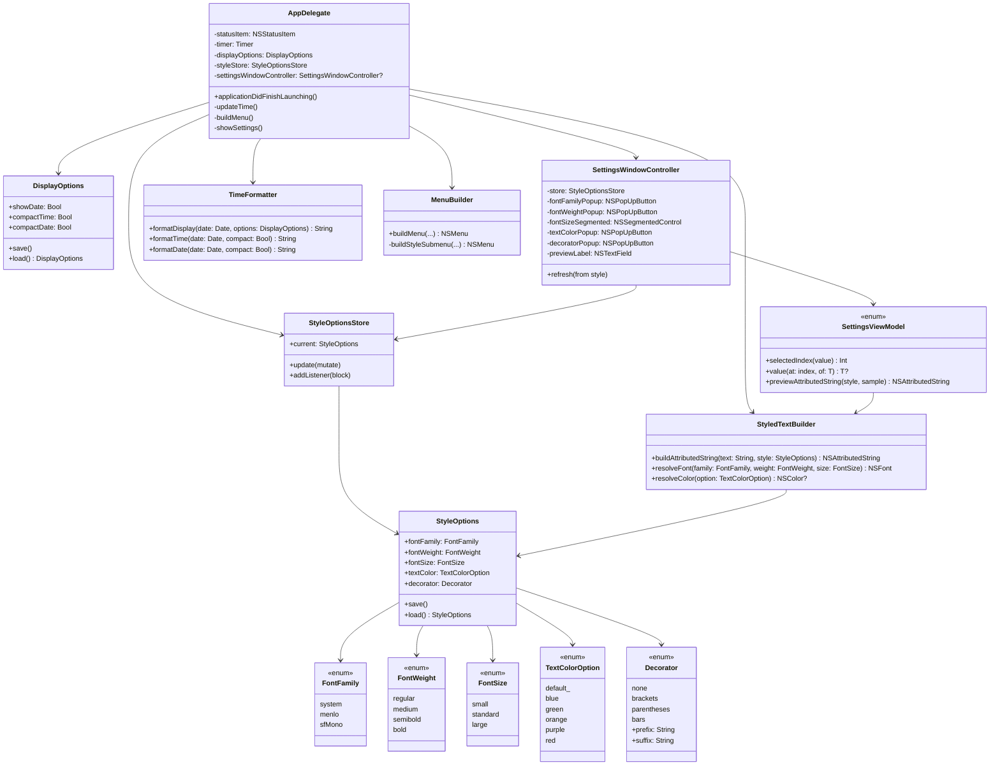
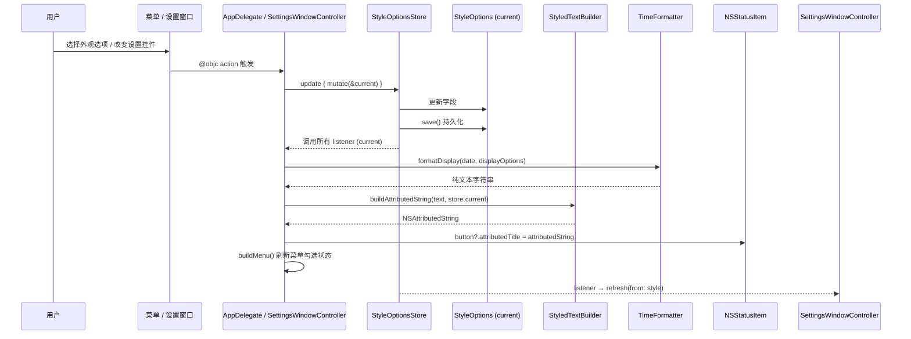
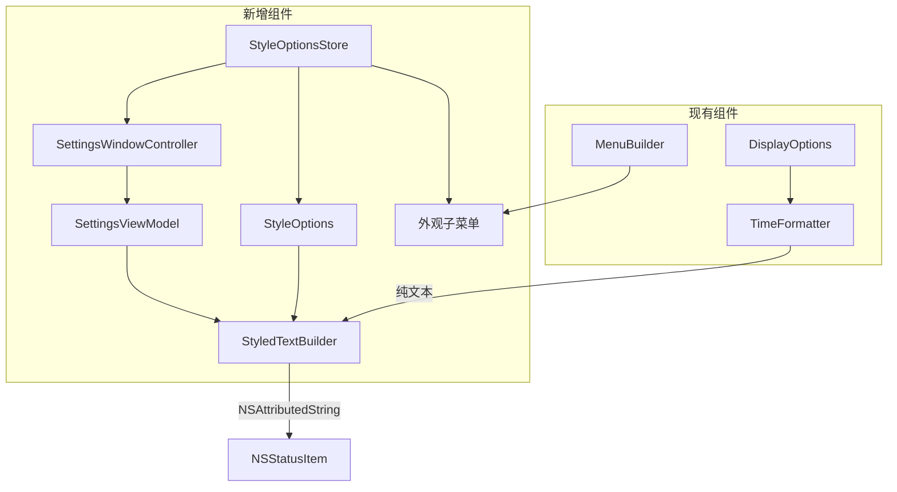

# 设计文档：视觉区分（Visual Distinction）

## 概述

本设计为 UTCMenuBar macOS 菜单栏应用添加视觉区分功能，解决 UTC 时间在菜单栏中容易与系统时间混淆的问题。

macOS 菜单栏对文字样式的支持有一定限制：系统会在 dark/light mode 切换时强制覆盖文字颜色，且 `NSStatusItem` 不原生支持背景色。但通过 `NSAttributedString` 配合 `attributedTitle` 属性，我们可以自由控制字体族（font family）、字重（font weight）、字号（font size），并在大多数情况下设置前景色。

本功能将提供以下视觉区分手段：
1. **字体样式** — 使用等宽字体（如 Menlo）或系统字体来区分系统时间
2. **字重** — 支持常规、中等、粗体等字重选择
3. **字号调整** — 允许用户微调字号大小
4. **自定义前缀/后缀** — 支持方括号包裹 `[14:30]` 或自定义装饰符
5. **文字颜色** — 提供预设颜色选项（有平台限制，见下方说明）

### 关于菜单栏文字颜色的平台限制

macOS 菜单栏对文字颜色的支持情况：

| 场景 | 颜色是否生效 | 说明 |
|------|-------------|------|
| 菜单栏正常状态 | ✅ 生效 | `NSAttributedString` 的 `foregroundColor` 正常显示 |
| 菜单栏被点击高亮时 | ❌ 被覆盖 | 系统强制使用白色文字 |
| Dark Mode | ✅ 生效 | 使用 `NSColor.system*` 系列颜色会自动适配 |
| Light Mode | ✅ 生效 | 同上 |
| 全屏应用时菜单栏半透明 | ⚠️ 可能不清晰 | 某些颜色在半透明背景上对比度不足 |

**结论**：颜色在绝大多数正常使用场景下是有效的。我们使用 `NSColor.system*` 系列颜色（如 `.systemBlue`、`.systemGreen`），这些颜色由系统管理，会自动适配 dark/light mode，是最安全的选择。唯一的限制是用户点击菜单栏项时颜色会被临时覆盖为高亮色，但这是所有菜单栏应用的标准行为，不影响日常使用中的视觉区分效果。

设计原则：
- 与现有 `DisplayOptions` 架构保持一致，扩展而非重写
- 从 `statusItem.button?.title`（纯文本）平滑迁移到 `attributedTitle`（富文本）
- 所有新设置通过 UserDefaults 持久化
- 菜单中新增"外观"子菜单，与现有选项分组清晰

## 架构

### 目标架构



### 数据流



### 与现有架构的集成



## 组件与接口

### StyleOptions（样式选项模型）

**职责**：
- 存储用户的视觉样式偏好
- 通过 UserDefaults 持久化/加载设置
- 提供合理的默认值

```swift
public struct StyleOptions: Equatable, Sendable {
    public var fontFamily: FontFamily
    public var fontWeight: FontWeight
    public var fontSize: FontSize
    public var textColor: TextColorOption
    public var decorator: Decorator

    public static let `default` = StyleOptions(
        fontFamily: .system,
        fontWeight: .regular,
        fontSize: .standard,
        textColor: .default,
        decorator: .none
    )
}
```

### StyledTextBuilder（富文本构建器）

**职责**：
- 将纯文本字符串和样式选项组合为 `NSAttributedString`
- 解析字体族、字重、字号为具体的 `NSFont`
- 解析颜色选项为 `NSColor`（考虑 dark/light mode）

```swift
public enum StyledTextBuilder {
    /// 根据样式选项构建富文本字符串
    public static func buildAttributedString(
        text: String,
        style: StyleOptions
    ) -> NSAttributedString

    /// 解析字体配置为具体 NSFont
    public static func resolveFont(
        family: FontFamily,
        weight: FontWeight,
        size: FontSize
    ) -> NSFont

    /// 解析颜色选项为 NSColor（nil 表示使用系统默认色）
    public static func resolveColor(
        option: TextColorOption
    ) -> NSColor?
}
```

### MenuBuilder 扩展

**职责**：
- 在现有菜单中新增"外观"子菜单
- 子菜单包含字体、字重、字号、颜色、装饰五个 radio 子菜单
- 在主菜单中追加"设置… ⌘,"项

```swift
public enum MenuBuilder {
    /// 构建完整菜单（扩展签名）
    public static func buildMenu(
        options: DisplayOptions,
        styleOptions: StyleOptions,
        target: AnyObject?,
        toggleShowDate: Selector?,
        toggleCompactTime: Selector?,
        toggleCompactDate: Selector?,
        // 样式相关 selectors（每个 selector 对应一类枚举）
        setFontFamily: Selector?,
        setFontWeight: Selector?,
        setFontSize: Selector?,
        setTextColor: Selector?,
        setDecorator: Selector?,
        showSettings: Selector?,
        quit: Selector?
    ) -> NSMenu
}
```

每个 radio 子菜单中，`NSMenuItem.tag` 存储该 case 在 `T.allCases` 中的索引，`@objc` action 通过 `sender.tag` 反查回 `FontFamily`/`FontWeight`/`FontSize`/`TextColorOption`/`Decorator`。

### StyleOptionsStore（样式单一事实源，应用层）

**位置**：`Sources/StyleOptionsStore.swift`（应用 target，非 lib target，因为它需要在 AppDelegate 与 SettingsWindowController 之间共享 actor 隔离的可变状态）。

**职责**：
- 持有当前 `StyleOptions`，作为 AppDelegate（菜单/状态栏）与 SettingsWindowController（设置窗口）的唯一事实源
- 集中所有的"修改 + 持久化 + 通知 listener"流程，避免两个 UI 各自写回 UserDefaults 时出现先后不一致
- 启动时通过 `StyleOptions.load(from:)` 还原

```swift
@MainActor
final class StyleOptionsStore {
    private(set) var current: StyleOptions
    init(defaults: UserDefaults = .standard)

    /// 修改当前 StyleOptions，自动 save 并广播给所有 listener。
    func update(_ mutate: (inout StyleOptions) -> Void)

    /// 注册一个变更监听器；listener 在每次 update 后被同步调用。
    func addListener(_ block: @escaping (StyleOptions) -> Void)
}
```

AppDelegate 注册的 listener 会重建菜单并调用 `updateTime()`；SettingsWindowController 注册的 listener 会调用 `refresh(from:)`。两条路径互不知道彼此存在。

### SettingsViewModel（库层纯逻辑）

**位置**：`Sources/UTCMenuBarLib/SettingsViewModel.swift`。

**职责**：
- 提供 `selectedIndex<T: CaseIterable & Equatable>(_:)` 与 `value<T: CaseIterable>(at:of:)`，把 NSPopUpButton/NSSegmentedControl 的整数索引与 `StyleOptions` 字段的枚举值之间的映射抽出为可单元测试的纯函数
- 提供 `previewAttributedString(style:sample:)`，复用 `StyledTextBuilder.buildAttributedString` 渲染设置窗口的预览（默认 sample = `"🌐 14:30:25 UTC"`）

```swift
public enum SettingsViewModel {
    public static func selectedIndex<T: CaseIterable & Equatable>(_ value: T) -> Int
    public static func value<T: CaseIterable>(at index: Int, of type: T.Type) -> T?
    public static func previewAttributedString(
        style: StyleOptions,
        sample: String = "🌐 14:30:25 UTC"
    ) -> NSAttributedString
}
```

### SettingsWindowController（设置窗口）

**位置**：`Sources/SettingsWindowController.swift`（应用 target，依赖 AppKit 与 NSWindow）。

**职责**：
- 提供与"外观"子菜单等价的 GUI 编辑入口，并附带实时预览
- 与 `StyleOptionsStore` 双向同步：控件变更 → `store.update`；store 变更 → `refresh(from:)`

**视图层级**（程序化 AppKit，无 .xib/.storyboard）：

```
NSWindow (380×260, [.titled, .closable], "UTCMenuBar 设置")
└── content NSView
    └── NSStackView (vertical, spacing=14, edgeInsets=20)
        ├── row("字体",   NSPopUpButton)              ← FontFamily.allCases.displayName
        ├── row("字重",   NSPopUpButton)              ← FontWeight.allCases.displayName
        ├── row("字号",   NSSegmentedControl)         ← FontSize.allCases，selectOne
        ├── row("颜色",   NSPopUpButton)              ← TextColorOption.allCases.displayName
        ├── row("装饰",   NSPopUpButton)              ← Decorator.allCases.displayName
        ├── NSBox(.separator)
        └── NSStackView (vertical, "预览" 标签 + previewLabel)
```

每行的 `row(_:_:)` 是一个水平 NSStackView：右对齐 60pt 宽的标签 + 控件。预览 NSTextField 宽度 ≥ 240pt，使用 `controlBackgroundColor` 作为 drawsBackground。

**API**：

```swift
@MainActor
final class SettingsWindowController: NSWindowController, NSWindowDelegate {
    init(store: StyleOptionsStore)
    func refresh(from style: StyleOptions)   // 把 store.current 推入所有控件
}
```

**生命周期决策**：
- `window.isReleasedWhenClosed = false`：关闭按钮只是隐藏窗口，控制器可被 AppDelegate 的 `settingsWindowController` 字段长期持有，复用同一实例
- 应用激活策略保持 `.accessory`（在 main.swift 的 `app.setActivationPolicy(.accessory)` 中设置一次，永不更改）。打开窗口时通过 `NSApp.activate(ignoringOtherApps: true)` 临时把窗口前置，避免切换到 `.regular` 而在 Dock 中显示图标

## 数据模型

### 枚举定义

```swift
public enum FontFamily: String, CaseIterable, Sendable {
    case system = "system"       // 系统默认字体（SF Pro）
    case menlo = "Menlo"         // 等宽字体 Menlo
    case sfMono = "SF Mono"      // 等宽字体 SF Mono

    public var displayName: String {
        switch self {
        case .system: return "系统字体"
        case .menlo: return "Menlo（等宽）"
        case .sfMono: return "SF Mono（等宽）"
        }
    }
}

public enum FontWeight: String, CaseIterable, Sendable {
    case regular = "regular"
    case medium = "medium"
    case semibold = "semibold"
    case bold = "bold"

    public var displayName: String {
        switch self {
        case .regular: return "常规"
        case .medium: return "中等"
        case .semibold: return "半粗"
        case .bold: return "粗体"
        }
    }

    public var nsWeight: NSFont.Weight {
        switch self {
        case .regular: return .regular
        case .medium: return .medium
        case .semibold: return .semibold
        case .bold: return .bold
        }
    }
}

public enum FontSize: String, CaseIterable, Sendable {
    case small = "small"         // 系统菜单栏字号 - 2
    case standard = "standard"   // 系统菜单栏默认字号
    case large = "large"         // 系统菜单栏字号 + 2

    public var displayName: String {
        switch self {
        case .small: return "小"
        case .standard: return "标准"
        case .large: return "大"
        }
    }

    public var pointSize: CGFloat {
        let baseSize = NSFont.menuBarFont(ofSize: 0).pointSize
        switch self {
        case .small: return baseSize - 2
        case .standard: return baseSize
        case .large: return baseSize + 2
        }
    }
}

public enum TextColorOption: String, CaseIterable, Sendable {
    case `default` = "default"   // 系统默认（跟随 dark/light mode）
    case blue = "blue"
    case green = "green"
    case orange = "orange"
    case purple = "purple"
    case red = "red"

    public var displayName: String {
        switch self {
        case .default: return "默认"
        case .blue: return "蓝色"
        case .green: return "绿色"
        case .orange: return "橙色"
        case .purple: return "紫色"
        case .red: return "红色"
        }
    }

    /// 返回适配 dark/light mode 的颜色
    public var nsColor: NSColor? {
        switch self {
        case .default: return nil
        case .blue: return .systemBlue
        case .green: return .systemGreen
        case .orange: return .systemOrange
        case .purple: return .systemPurple
        case .red: return .systemRed
        }
    }
}
```

### Decorator 枚举

```swift
public enum Decorator: String, CaseIterable, Sendable {
    case none, brackets, parentheses, bars

    public var displayName: String   // "无装饰" / "[方括号]" / "(圆括号)" / "│竖线│"
    public var prefix: String        // "" / "[" / "(" / "│"
    public var suffix: String        // "" / "]" / ")" / "│"
}
```

`prefix`/`suffix` 是 case 上的计算属性（不是 `StyleOptions` 上的存储字段），由 `StyledTextBuilder` 直接读取。

### StyleOptions 持久化

| 属性 | 类型 | 默认值 | UserDefaults 键 |
|------|------|--------|-----------------|
| `fontFamily` | `FontFamily` | `.system` | `styleOptions.fontFamily` |
| `fontWeight` | `FontWeight` | `.regular` | `styleOptions.fontWeight` |
| `fontSize` | `FontSize` | `.standard` | `styleOptions.fontSize` |
| `textColor` | `TextColorOption` | `.default` | `styleOptions.textColor` |
| `decorator` | `Decorator` | `.none` | `styleOptions.decorator` |

每个键存储对应枚举的 `rawValue`；加载时通过 `T.init(rawValue:)` 解析，失败回退到默认值。

### 预设装饰符选项

| Decorator case | displayName | prefix | suffix | 效果示例 |
|----------------|-------------|--------|--------|---------|
| `.none` | 无装饰 | `""` | `""` | `🌐 14:30 UTC` |
| `.brackets` | [方括号] | `[` | `]` | `[🌐 14:30 UTC]` |
| `.parentheses` | (圆括号) | `(` | `)` | `(🌐 14:30 UTC)` |
| `.bars` | │竖线│ | `│` | `│` | `│🌐 14:30 UTC│` |

## 算法伪代码

### 富文本构建算法

```swift
/// 核心算法：将纯文本 + 样式选项转换为 NSAttributedString
///
/// 前置条件：
/// - text 非空
/// - style 是有效的 StyleOptions 实例
///
/// 后置条件：
/// - 返回的 NSAttributedString 包含完整的 text 内容
/// - 字体、字重、字号、颜色均已正确应用
/// - 当 textColor 为 .default 时，不设置 foregroundColor 属性（使用系统默认）
public static func buildAttributedString(
    text: String,
    style: StyleOptions
) -> NSAttributedString {
    // Step 1: 解析字体
    let font = resolveFont(
        family: style.fontFamily,
        weight: style.fontWeight,
        size: style.fontSize
    )

    // Step 2: 构建属性字典
    var attributes: [NSAttributedString.Key: Any] = [
        .font: font
    ]

    // Step 3: 解析颜色（仅非默认时设置）
    if let color = resolveColor(option: style.textColor) {
        attributes[.foregroundColor] = color
    }

    // Step 4: 应用 decorator 前后缀
    let decoratedText = style.decorator.prefix + text + style.decorator.suffix

    // Step 5: 构建并返回 NSAttributedString
    return NSAttributedString(string: decoratedText, attributes: attributes)
}
```

**前置条件：**
- `text` 是由 `TimeFormatter.formatDisplay` 生成的有效显示字符串
- `style` 中所有枚举值均为有效 case

**后置条件：**
- 返回值的 `.string` 属性等于 `style.decorator.prefix + text + style.decorator.suffix`
- 返回值在整个字符串范围内具有一致的属性
- 当 `style.textColor == .default` 时，属性中不包含 `.foregroundColor` 键

**循环不变量：** 无循环

### 字体解析算法

```swift
/// 将字体族、字重、字号组合解析为具体的 NSFont
///
/// 前置条件：
/// - family, weight, size 均为有效枚举值
///
/// 后置条件：
/// - 返回非 nil 的 NSFont 实例
/// - 字体的 pointSize 等于 size.pointSize
/// - 字体族和字重与输入匹配（或回退到系统字体）
public static func resolveFont(
    family: FontFamily,
    weight: FontWeight,
    size: FontSize
) -> NSFont {
    let pointSize = size.pointSize

    switch family {
    case .system:
        // 系统字体的等宽数字变体：字母保持比例宽度，数字为表格宽度，
        // 避免时钟每秒变宽/变窄导致菜单栏相邻图标抖动
        return NSFont.monospacedDigitSystemFont(ofSize: pointSize, weight: weight.nsWeight)

    case .menlo:
        // Menlo 字体，通过 font descriptor 应用字重
        if let font = NSFont(name: "Menlo", size: pointSize) {
            return applyWeight(to: font, weight: weight)
        }
        // 回退到系统等宽字体
        return NSFont.monospacedSystemFont(ofSize: pointSize, weight: weight.nsWeight)

    case .sfMono:
        // SF Mono，优先使用 monospacedSystemFont
        return NSFont.monospacedSystemFont(ofSize: pointSize, weight: weight.nsWeight)
    }
}

/// 通过 font descriptor 为字体应用字重
private static func applyWeight(to font: NSFont, weight: FontWeight) -> NSFont {
    let descriptor = font.fontDescriptor.addingAttributes([
        .traits: [NSFontDescriptor.TraitKey.weight: weight.nsWeight]
    ])
    return NSFont(descriptor: descriptor, size: font.pointSize) ?? font
}
```

**前置条件：**
- `family` 是 `FontFamily` 的有效 case
- `weight` 是 `FontWeight` 的有效 case
- `size` 是 `FontSize` 的有效 case

**后置条件：**
- 始终返回有效的 `NSFont` 实例（通过回退机制保证）
- 返回字体的 `pointSize` 等于 `size.pointSize`

### 显示更新算法

```swift
/// AppDelegate 中的显示更新流程
///
/// 前置条件：
/// - statusItem 已初始化
/// - displayOptions 和 styleStore 已加载
///
/// 后置条件：
/// - statusItem.button?.attributedTitle 已更新为最新的富文本
/// - 显示内容反映当前的 displayOptions 和 styleStore.current
private func updateTime() {
    // Step 1: 生成纯文本（复用现有 TimeFormatter）
    let plainText = TimeFormatter.formatDisplay(
        date: Date(),
        options: displayOptions
    )

    // Step 2: 应用视觉样式生成富文本
    let styledText = StyledTextBuilder.buildAttributedString(
        text: plainText,
        style: styleStore.current
    )

    // Step 3: 设置到 status item（使用 attributedTitle 替代 title）
    statusItem.button?.attributedTitle = styledText
    statusItem.button?.title = ""   // 清空纯文本 title 防止双重渲染
}
```

### StyleOptions 持久化算法

```swift
/// 保存样式选项到 UserDefaults
///
/// 前置条件：
/// - self 是有效的 StyleOptions 实例
///
/// 后置条件：
/// - 所有属性已写入 UserDefaults
/// - 后续调用 StyleOptions.load() 将返回等价的实例
public func save(to defaults: UserDefaults = .standard) {
    defaults.set(fontFamily.rawValue, forKey: StyleOptions.fontFamilyKey)
    defaults.set(fontWeight.rawValue, forKey: StyleOptions.fontWeightKey)
    defaults.set(fontSize.rawValue, forKey: StyleOptions.fontSizeKey)
    defaults.set(textColor.rawValue, forKey: StyleOptions.textColorKey)
    defaults.set(decorator.rawValue, forKey: StyleOptions.decoratorKey)
}

/// 从 UserDefaults 加载样式选项
///
/// 前置条件：
/// - defaults 是有效的 UserDefaults 实例
///
/// 后置条件：
/// - 返回有效的 StyleOptions 实例
/// - 对于无法解析的值，回退到默认值
public static func load(from defaults: UserDefaults = .standard) -> StyleOptions {
    let family = (defaults.string(forKey: fontFamilyKey).flatMap(FontFamily.init(rawValue:))) ?? .system
    let weight = (defaults.string(forKey: fontWeightKey).flatMap(FontWeight.init(rawValue:))) ?? .regular
    let size = (defaults.string(forKey: fontSizeKey).flatMap(FontSize.init(rawValue:))) ?? .standard
    let color = (defaults.string(forKey: textColorKey).flatMap(TextColorOption.init(rawValue:))) ?? .default
    let decorator = (defaults.string(forKey: decoratorKey).flatMap(Decorator.init(rawValue:))) ?? .none
    return StyleOptions(
        fontFamily: family,
        fontWeight: weight,
        fontSize: size,
        textColor: color,
        decorator: decorator
    )
}
```

## 关键函数与形式化规格

### StyledTextBuilder.buildAttributedString()

```swift
public static func buildAttributedString(text: String, style: StyleOptions) -> NSAttributedString
```

**前置条件：**
- `text.isEmpty == false`（由 TimeFormatter 保证至少包含 "🌐  UTC"）
- `style` 中所有枚举属性为有效 case

**后置条件：**
- `result.string == style.decorator.prefix + text + style.decorator.suffix`
- `result.length == (style.decorator.prefix + text + style.decorator.suffix).count`
- 属性在整个字符串范围内一致（单一样式）
- 当 `style.textColor == .default` 时，属性中无 `.foregroundColor`
- 当 `style.textColor != .default` 时，`.foregroundColor` 为对应的 `NSColor`

### StyledTextBuilder.resolveFont()

```swift
public static func resolveFont(family: FontFamily, weight: FontWeight, size: FontSize) -> NSFont
```

**前置条件：**
- 所有参数为有效枚举值

**后置条件：**
- 返回值非 nil（通过回退机制保证）
- `result.pointSize == size.pointSize`
- 当 `family == .system` 时，使用 `NSFont.monospacedDigitSystemFont`（系统字体的等宽数字变体）
- 当 `family == .sfMono` 时，使用 `NSFont.monospacedSystemFont`
- 当 `family == .menlo` 时，尝试 Menlo 字体，失败则回退到等宽系统字体

### StyleOptions.save() / load()

```swift
public func save(to defaults: UserDefaults)
public static func load(from defaults: UserDefaults) -> StyleOptions
```

**前置条件：**
- `defaults` 是有效的 UserDefaults 实例

**后置条件（往返一致性）：**
- 对于任意 `StyleOptions s`：`StyleOptions.load(from: d)` 在 `s.save(to: d)` 之后返回值等于 `s`

**后置条件（容错性）：**
- 对于 UserDefaults 中不存在或无效的值，`load()` 返回对应属性的默认值

## 示例用法

```swift
// 示例 1：使用等宽粗体字体
let style = StyleOptions(
    fontFamily: .menlo,
    fontWeight: .bold,
    fontSize: .standard,
    textColor: .default,
    decorator: .none
)
let text = "🌐 14:30:25 UTC"
let attributed = StyledTextBuilder.buildAttributedString(text: text, style: style)
statusItem.button?.attributedTitle = attributed
// 结果：菜单栏显示 Menlo 粗体的 "🌐 14:30:25 UTC"

// 示例 2：蓝色方括号包裹
let style2 = StyleOptions(
    fontFamily: .sfMono,
    fontWeight: .medium,
    fontSize: .standard,
    textColor: .blue,
    decorator: .brackets
)
let attributed2 = StyledTextBuilder.buildAttributedString(text: text, style: style2)
// 结果：菜单栏显示蓝色 SF Mono 中等字重的 "[🌐 14:30:25 UTC]"

// 示例 3：完整的 updateTime 流程（经由 StyleOptionsStore）
let displayOpts = DisplayOptions(showDate: false, compactTime: true, compactDate: false)
let store = StyleOptionsStore()    // 内部从 UserDefaults 加载 current
let plainText = TimeFormatter.formatDisplay(date: Date(), options: displayOpts)
// plainText = "🌐 14:30 UTC"
let styledText = StyledTextBuilder.buildAttributedString(text: plainText, style: store.current)
statusItem.button?.attributedTitle = styledText
```

## 正确性属性

### 属性 1：富文本内容等于装饰后的纯文本

*对于任意*有效的 `text` 和 `StyleOptions style`，`buildAttributedString(text, style).string` 等于 `style.decorator.prefix + text + style.decorator.suffix`。前后缀来自 `Decorator` 枚举对应 case 的计算属性，不是 `StyleOptions` 自身的存储字段。

**验证目标：** 确保富文本转换不丢失或修改文本内容

### 属性 2：字体解析始终返回有效字体

*对于任意* `FontFamily`、`FontWeight`、`FontSize` 的组合，`resolveFont` 始终返回非 nil 的 `NSFont` 实例，且其 `pointSize` 等于 `size.pointSize`。

**验证目标：** 确保字体回退机制正确工作

### 属性 3：颜色解析与选项一致

*对于任意* `TextColorOption option`：
- 当 `option == .default` 时，`resolveColor(option)` 返回 `nil`
- 当 `option != .default` 时，`resolveColor(option)` 返回非 nil 的 `NSColor`

**验证目标：** 确保默认颜色不覆盖系统行为

### 属性 4：StyleOptions 持久化往返一致性

*对于任意* `StyleOptions` 值，将其保存到 UserDefaults 后再加载，应得到与原始值相等的 `StyleOptions`。

**验证目标：** 确保用户设置不会在重启后丢失

### 属性 5：StyleOptions 加载容错性

*对于任意*无效或缺失的 UserDefaults 值，`StyleOptions.load()` 应返回有效的 `StyleOptions` 实例（使用默认值填充无效字段）。

**验证目标：** 确保应用在 UserDefaults 损坏时不崩溃

### 属性 6：属性一致性

*对于任意*有效的 `text` 和 `StyleOptions`，生成的 `NSAttributedString` 在整个字符串范围内具有一致的属性（不存在部分范围使用不同样式的情况）。

**验证目标：** 确保不会出现样式断裂

### 属性 7：菜单选中状态与样式选项一致

*对于任意* `StyleOptions` 状态，外观子菜单的五个 radio 子菜单（字体/字重/字号/颜色/装饰）中每个选项的勾选标记应满足：当且仅当该 case 等于 `StyleOptions` 中对应字段时显示为 `.on`，其余项均为 `.off`（互斥单选不变量）。

**验证目标：** 确保菜单 UI 准确反映当前设置

### 属性 8：与现有 DisplayOptions 功能兼容

*对于任意* `DisplayOptions` 和 `StyleOptions` 的组合，`TimeFormatter.formatDisplay` 的输出不受 `StyleOptions` 影响（样式仅影响渲染，不影响文本内容）。

**验证目标：** 确保新功能不破坏现有显示逻辑

### 属性 9：设置窗口控件状态与单一事实源一致

*在任意时刻*，若 SettingsWindowController 已加载，则其控件的选中值（fontFamilyPopup、fontWeightPopup、fontSizeSegmented、textColorPopup、decoratorPopup）应与 `StyleOptionsStore.current` 中相应字段一致；预览 NSTextField 的 `attributedStringValue` 应等于 `SettingsViewModel.previewAttributedString(style: store.current)`。

**验证目标：** 确保两条 UI 路径（菜单 vs 设置窗口）共享同一事实源，避免任意一侧更改后另一侧出现"陈旧"显示。

**验证方式：** 该属性涉及 NSWindow 实例化，无法在当前自定义 test runner 中以无头方式自动验证；通过 `SettingsViewModelTests` 间接覆盖映射纯函数（属性 9 的子集），UI 同步则手工验证。

## 错误处理

### 字体不可用

**条件**：用户选择的字体（如 Menlo）在系统中不存在
**响应**：`resolveFont` 回退到 `NSFont.monospacedSystemFont`
**恢复**：自动恢复，用户无感知

### UserDefaults 值无效

**条件**：存储的 rawValue 无法解析为对应枚举
**响应**：`load()` 使用 `?? .defaultValue` 回退到默认值
**恢复**：自动恢复，下次保存时会写入有效值

### attributedTitle 设置失败

**条件**：`statusItem.button` 为 nil（理论上不应发生）
**响应**：可选链 `?.attributedTitle` 安全地不执行任何操作
**恢复**：下次 timer 触发时重试

### Dark/Light Mode 切换

**条件**：系统外观模式变化可能影响自定义颜色的可见性
**响应**：使用 `NSColor.system*` 系列颜色，这些颜色会自动适配外观模式
**恢复**：无需手动处理，系统颜色自动调整

## 测试策略

### 单元测试

- **默认值测试**：验证 `StyleOptions.default` 所有属性为预期默认值
- **字体解析测试**：验证每种 `FontFamily` × `FontWeight` × `FontSize` 组合都返回有效字体
- **颜色解析测试**：验证每种 `TextColorOption` 返回正确的颜色或 nil
- **富文本构建测试**：验证具体输入的精确输出
- **前缀/后缀测试**：验证装饰符正确应用
- **菜单结构测试**：验证外观子菜单包含所有选项且状态正确

### 属性测试（Property-Based Testing）

使用自定义随机输入生成器，每个属性测试至少运行 100 次迭代：

| 属性 | 测试描述 |
|------|---------|
| 属性 1 | 生成随机 text 和 StyleOptions，验证 attributedString.string 等于装饰后文本 |
| 属性 2 | 生成随机 FontFamily/Weight/Size 组合，验证 resolveFont 返回有效字体且 pointSize 正确 |
| 属性 4 | 生成随机 StyleOptions，保存后加载，验证往返一致性 |
| 属性 5 | 向 UserDefaults 写入随机无效字符串，验证 load() 返回有效默认值 |
| 属性 6 | 生成随机输入，验证 attributedString 属性在全范围一致 |
| 属性 8 | 生成随机 DisplayOptions + StyleOptions，验证 formatDisplay 输出不受 StyleOptions 影响 |

### 集成测试

- **端到端流程**：模拟用户切换样式选项，验证 statusItem 的 attributedTitle 正确更新
- **持久化集成**：验证应用重启后样式设置正确恢复
- **与 DisplayOptions 共存**：验证同时修改显示选项和样式选项时行为正确

## 性能考虑

- `NSAttributedString` 创建开销极小，每秒一次的 timer 更新不会有性能问题
- `NSFont` 解析可以考虑缓存，但鉴于调用频率（每秒一次）和系统字体查找的高效性，暂不需要
- 菜单重建策略与现有方案一致：每次选项变更时重建整个菜单

## 安全考虑

- 前缀/后缀字符串来自预设选项（非自由输入），无注入风险
- UserDefaults 存储的是枚举 rawValue 字符串，加载时通过枚举初始化器验证，无效值安全回退
- 不涉及网络请求或敏感数据

## 依赖

- **AppKit**（`NSAttributedString`、`NSFont`、`NSColor`）— 已有依赖
- **Foundation**（`UserDefaults`）— 已有依赖
- 无新增外部依赖

## 菜单结构设计

### 扩展后的菜单布局

```
主菜单（共 8 个 NSMenuItem）：
┌─────────────────────────────┐
│ ✓ 显示日期                  │  index 0
│ ─ 紧凑时间                  │  index 1
│ ─ 紧凑日期                  │  index 2
│ ─────────────────────────── │  index 3 (separator)
│ 外观                      ▶ │  index 4
│ 设置…                    ⌘, │  index 5
│ ─────────────────────────── │  index 6 (separator)
│ Quit                      Q │  index 7
└─────────────────────────────┘

外观子菜单（共 5 项，每项均为 radio 子菜单）：
┌─────────────────────────────┐
│ 字体                      ▶ │
│ 字重                      ▶ │
│ 字号                      ▶ │
│ 颜色                      ▶ │
│ 装饰                      ▶ │
└─────────────────────────────┘

字体子菜单（FontFamily.allCases）：
┌─────────────────────────────┐
│ ✓ 系统字体                  │
│ ─ Menlo（等宽）             │
│ ─ SF Mono（等宽）           │
└─────────────────────────────┘

装饰子菜单（Decorator.allCases）：
┌─────────────────────────────┐
│ ✓ 无装饰                    │
│ ─ [方括号]                  │
│ ─ (圆括号)                  │
│ ─ │竖线│                    │
└─────────────────────────────┘
```

### 菜单交互设计

- 每个 radio 子菜单中的选项为互斥单选，当前选中项显示勾选标记
- 切换任何选项后立即生效，无需确认；变更经由 `StyleOptionsStore.update`
- 使用 `NSMenuItem.tag` 存储 case 在 `T.allCases` 中的索引，`@objc` action 通过 `sender.tag` 与 `Array(T.allCases)[safe: tag]` 反查回枚举值
- "设置…"项的 `keyEquivalent == ","`，`keyEquivalentModifierMask` 包含 `.command`（即 `⌘,`）

## 需求 11 设计：图标前缀

### IconPrefix 枚举

```swift
public enum IconPrefix: String, CaseIterable, Sendable {
    case globe = "globe"
    case clock = "clock"
    case compass = "compass"
    case earth = "earth"
    case none = "none"

    public var displayName: String   // "地球仪" / "时钟" / "指南针" / "地球" / "无图标"
    public var prefix: String        // "🌐 " / "🕐 " / "🧭 " / "🌍 " / ""
}
```

`prefix` 是计算属性，包含图标后的空格（与历史 "🌐 " 行为一致）；`.none` 返回空字符串。`StyleOptions` 新增 `iconPrefix: IconPrefix` 字段，默认 `.globe`，通过 UserDefaults 键 `styleOptions.iconPrefix` 持久化。

### TimeFormatter API 变更

`formatDisplay(date:options:)` 增加可选参数 `iconPrefix: IconPrefix = .globe`。默认值保证既有调用点（含测试）不变；前缀来自 `iconPrefix.prefix`，替换原硬编码的 `"🌐 "`。

```swift
public static func formatDisplay(
    date: Date,
    options: DisplayOptions,
    iconPrefix: IconPrefix = .globe
) -> String
```

设计原则：图标是**内容**（与 " UTC" 后缀同层），由 `TimeFormatter` 拼接；不是 `StyledTextBuilder` 的视觉装饰。

### 外观子菜单更新

外观子菜单从 5 项扩展为 6 项：字体、字重、字号、颜色、**图标**、装饰。"图标"插入在颜色与装饰之间，对应一个 radio 子菜单（5 项 = `IconPrefix.allCases`）。设置窗口同步增加一行 `row("图标", iconPrefixPopup)`。

## 需求 12 设计：自定义字体

### FontFamily 扩展

```swift
public enum FontFamily: String, CaseIterable, Sendable {
    case system = "system"
    case menlo = "Menlo"
    case sfMono = "SF Mono"
    case custom = "custom"     // 新增

    public var displayName: String {
        // ... .custom: return "自定义…"
    }
}
```

`.custom` 作为新 case 追加到 `allCases` 末尾，旧 `rawValue`（"system"/"Menlo"/"SF Mono"）持久化向后兼容。`StyleOptions` 新增 `customFontName: String` 字段（默认 `""`），UserDefaults 键 `styleOptions.customFontName`。该字段仅在 `fontFamily == .custom` 时生效。

### StyledTextBuilder.resolveFont 扩展

```swift
public static func resolveFont(
    family: FontFamily,
    weight: FontWeight,
    size: FontSize,
    customFontName: String = ""
) -> NSFont {
    let pt = size.pointSize
    switch family {
    // ...原有 case 不变...
    case .custom:
        let trimmed = customFontName.trimmingCharacters(in: .whitespacesAndNewlines)
        if !trimmed.isEmpty, let f = NSFont(name: trimmed, size: pt) {
            return applyWeight(to: f, weight: weight)
        }
        return NSFont.monospacedDigitSystemFont(ofSize: pt, weight: weight.nsWeight)
    }
}
```

`buildAttributedString` 内部把 `style.customFontName` 转发给 `resolveFont`。回退路径与 `.menlo` 类似，但回退到等宽数字系统字体而非全等宽 system font：字母保持比例宽度（自定义意图通常不是等宽），数字用表格宽度保证菜单栏宽度稳定。

### 字体面板交互

字体子菜单与设置窗口字体下拉框均把"自定义…"作为最后一项渲染。点击该项不会直接把 `fontFamily` 写为 `.custom`，而是触发：

1. 通过 `NSFontManager.setSelectedFont(_:isMultiple:)` 把当前已解析字体作为初始值
2. 把一个 `FontPanelDelegate` 注册为 `NSFontManager.target`，`changeFont(_:)` 作为 action
3. 调用 `NSFontPanel.shared.makeKeyAndOrderFront(nil)` 弹出系统字体面板

`FontPanelDelegate.changeFont(_:)` 通过 `manager.convert(currentFont)` 取得用户选定的新字体，调用 `store.update { $0.fontFamily = .custom; $0.customFontName = picked.fontName }`。listener 链统一刷新菜单 / attributedTitle / 设置窗口预览。

设置窗口字体下拉框中"自定义…"项的标题在 `refresh(from:)` 中按需重写为 `"自定义：\(customFontName)"`，菜单栏字体子菜单同理（在 `MenuBuilder` 中通过 displayName 闭包动态计算）。

### 持久化兼容性

| 升级前 | 升级后 load() 行为 |
|--------|-------------------|
| `fontFamily=menlo`, 无 `customFontName` 键 | `fontFamily=.menlo`, `customFontName=""` |
| `fontFamily=custom`, `customFontName="Helvetica"` | 完整还原 |
| `fontFamily=custom`, `customFontName=""` 或缺失 | `.custom` 保留，但 `resolveFont` 在渲染时回退到 system font |

`load()` 中 `defaults.string(forKey: customFontNameKey) ?? ""` 保证缺失键不抛错。空白名也会进入回退路径。

### 属性 10：图标前缀作用于 TimeFormatter 输出起始

*对于任意* `Date` 与 `DisplayOptions`，`formatDisplay(date:options:iconPrefix: p)` 的输出以 `p.prefix` 起始，并以 `" UTC"` 结尾；其他部分（日期、时间、空格分隔）与既有行为一致。当 `p == .none` 时输出不含图标字符。

### 属性 11：自定义字体回退保持 pointSize 正确

*对于任意* `FontWeight` 与 `FontSize`，无论 `customFontName` 是否有效，`resolveFont(family: .custom, weight:, size:, customFontName:)` 始终返回非 nil 的 `NSFont` 且其 `pointSize == size.pointSize`。这保证用户输入无效字体名时菜单栏不会渲染异常。
